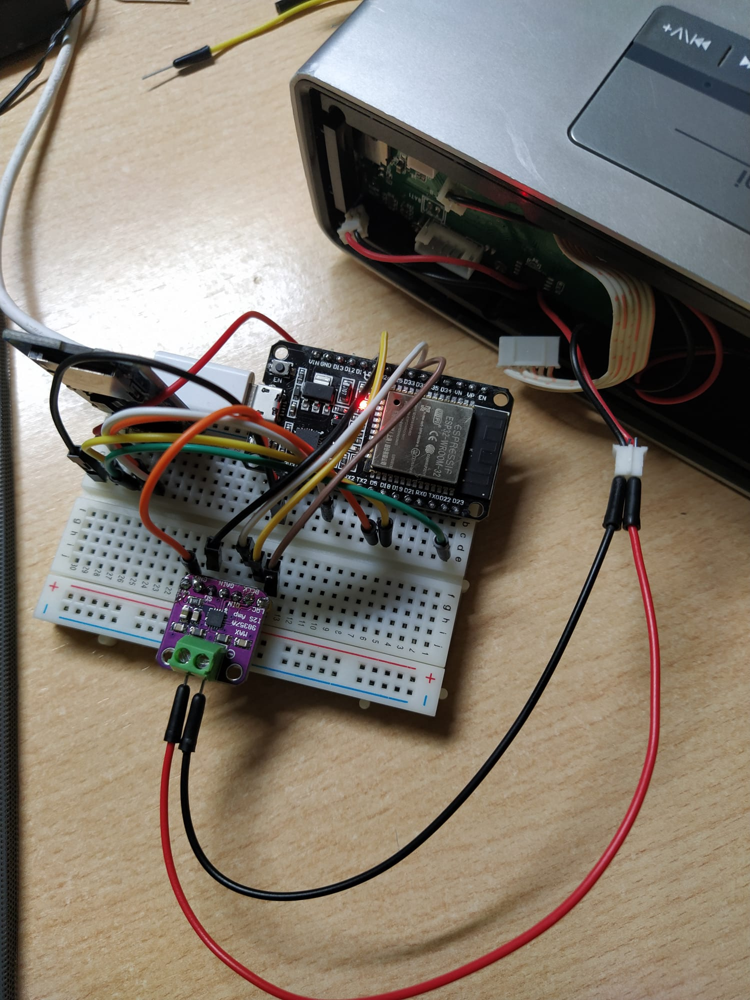

# PRACTICA 7: BUS I2S

En esta practica usaremos el bus I2S usado especificamente para el audio. 

## Ejercicio 1: Reproducir audio

Para este primer ejercicio usamos un programa ya creado para reproducir una muestra de audio. 

Este ejemplo se puede encontrar en esta librería de audio:
https://github.com/earlephilhower/ESP8266Audio

El codigo es el siguiente: 
```cpp
#include <Arduino.h>
#include "FS.h"
#include "HTTPClient.h"
#include "SPIFFS.h"
#include "SD.h"
#include "AudioGeneratorAAC.h"
#include "AudioOutputI2S.h"
#include "AudioFileSourcePROGMEM.h"
#include "sampleaac.h"

AudioFileSourcePROGMEM *in;
AudioGeneratorAAC *aac;
AudioOutputI2S *out;

void setup(){

Serial.begin(9600);
in = new AudioFileSourcePROGMEM(sampleaac, sizeof(sampleaac));
aac = new AudioGeneratorAAC();
out = new AudioOutputI2S();
out -> SetGain(0.125);
out -> SetPinout(26,25,22);

aac->begin(in, out);
}

void loop(){

if (aac->isRunning()) {
aac->loop();
} else {
// aac -> stop();
Serial.printf("Sound Generator\n");
delay(1000);

in = new AudioFileSourcePROGMEM(sampleaac, sizeof(sampleaac));
aac->begin(in,out);
}

}

```

* Explicación:

En la cabezera debemos de incluir las diferentes cabezeras y librerías. 
```cpp
#include <Arduino.h>
#include "FS.h"
#include "HTTPClient.h"
#include "SPIFFS.h"
#include "SD.h"
#include "AudioGeneratorAAC.h"
#include "AudioOutputI2S.h"
#include "AudioFileSourcePROGMEM.h"
#include "sampleaac.h"
```

Declaramos los parametros de entrada, salida i la fuente de audio. 
```cpp
AudioFileSourcePROGMEM *in;
AudioGeneratorAAC *aac;
AudioOutputI2S *out;
```

Tras inicializar la comunicación serie, configuramos la entrada deseada, la muestra del audio y la salida con las funciones de la librería ESP8266AUDIO. 

Para que se reproduzca, configuramos una ganancia y los pines de salida que conectan el bus I2S. 
Finalmente hacemos que se reproduzca una vez con el *aac->begin(in,out)*.


```cpp

void setup(){

Serial.begin(9600);
in = new AudioFileSourcePROGMEM(sampleaac, sizeof(sampleaac));
aac = new AudioGeneratorAAC();
out = new AudioOutputI2S();
out -> SetGain(2);
out -> SetPinout(26,25,22);
aac->begin(in, out);
}
```
Esa parte ha sido modificada ligeramente para que el programa reproduzca la muestra en bucle. 

Tras ver si la muestra ha terminado de ser reproducida, en vez de parar el *aac* declaramos de nuevo la entrada de audio *in* y la enchegamos de nuevo. 
De esta forma cuando se acabe de reproducir volverá a sonar. 

```cpp
void loop(){

if (aac->isRunning()) {
aac->loop();
} else {
// aac -> stop();
Serial.printf("Sound Generator\n");
delay(1000);

}

}

```
* Salida puerto serie: 

Cada vez que se reproduzca la muestra se mostrará: 
```
Sound Generator
```

## Ejercicio 2: Lectura de audio en SD. 

En este ejercicio en vez de reproducir una muestra cualquiera, reproduciremos una canción o muestra que nosotros deaseamos, utilizando el lector de tarjetas SD (bus SPI) empleada en la practica anterior. 

El montaje sería el siguiente:



Teniendo en cuenta el montage, casi podriamos decir que es mas simple el codigo:

1. Includes necesarios
```cpp
#include <Arduino.h>
#include "Audio.h"
#include "SD.h"
#include "FS.h"
```
2. Delcaracion de pines para los difrentes buses. 
```cpp
// Digital I/O used
#define SD_CS 4
#define SPI_MOSI 23
#define SPI_MISO 19
#define SPI_SCK 18
#define I2S_DOUT 25
#define I2S_BCLK 27
#define I2S_LRC 26
```
3. Declaracion variable audio de tipo *Audio* donde se almacenará el sonido y sus caracteristicas/configuraciones
```cpp
extern Audio audio;
```

4. Comunicación puerto serie y connexion con lector de tarjetas con bus SPI. 
```cpp
void setup(){
Serial.begin(9600);

pinMode(SD_CS, OUTPUT);
digitalWrite(SD_CS, HIGH);
SPI.begin(SPI_SCK, SPI_MISO, SPI_MOSI);
SD.begin(SD_CS);
```
5. Configuracion de la variable audio. 
    - Declaracion pines del bus I2S
    - Ajustar volumen
    - Leer archivo de audio des de la File Source. 
```cpp
audio.setPinout(I2S_BCLK, I2S_LRC, I2S_DOUT);
audio.setVolume(10); // 0...21
audio.connecttoFS(SD, "Ensoniq-ZR-76-01-Dope-77.wav");
```

6. Reproducción.
```cpp
}
void loop(){
audio.loop();
}
```


